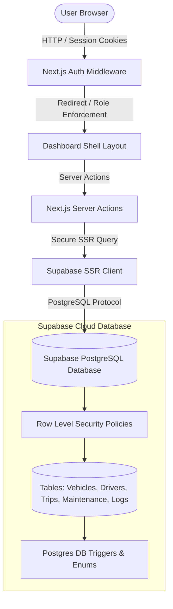
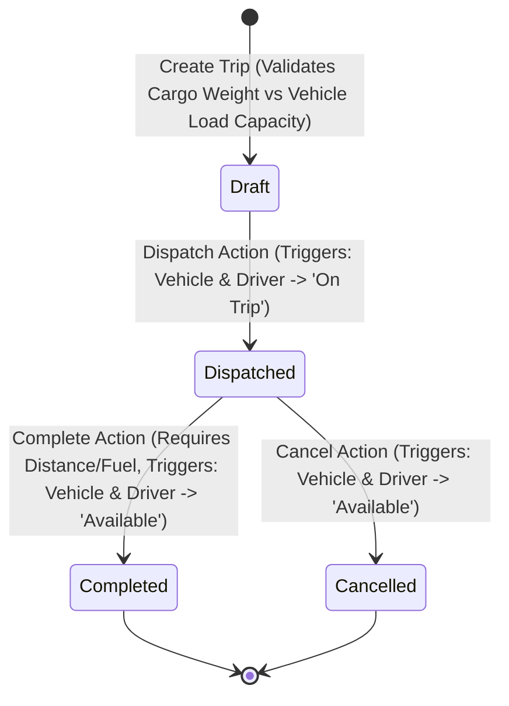
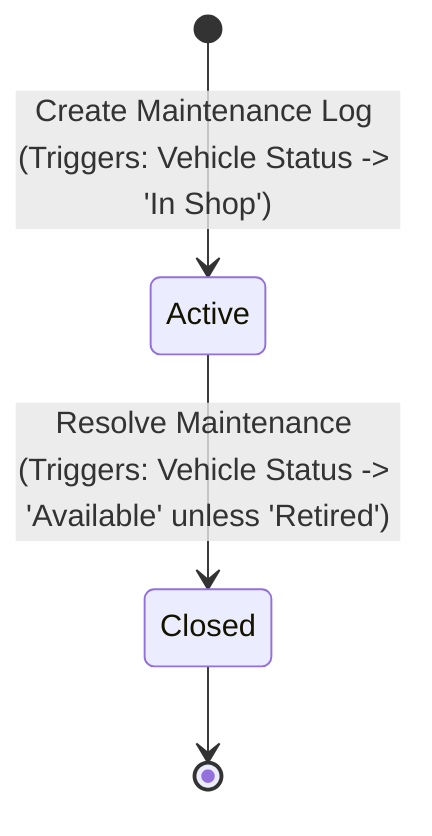

# 🚛 TransitOps — Smart Transport Operations Platform

TransitOps is a full-stack, enterprise-grade fleet management dashboard built for real-time tracking, resource allocation, and operational analytics. It is designed to coordinate operations between managers, safety officers, drivers, and financial analysts seamlessly.

Built with **Next.js 15 (App Router)**, **TypeScript**, **Tailwind CSS**, and **Supabase (Auth, PostgreSQL, Triggers, and Row-Level Security)**.

---

## 📌 System Architecture

The application relies on Next.js Server Components and Server Actions to securely interact with Supabase. Role-Based Access Control (RBAC) is enforced at both the **Middleware layer** (preventing unauthorized routing) and the **Database layer** via Row-Level Security (RLS) policies.



---

## 👥 Hackathon Team & Branch Roles

We divide the project feature-wise to enable clean parallel development with minimal conflicts:

| Member / Role | Focus Area | Branch Name | Key Files |
| :--- | :--- | :--- | :--- |
| **👨💻 Member 1 (Lead)** | Authentication, Core Infrastructure, Database, Middleware, Layout | `feature/auth-core` | `supabase/*`, `src/utils/supabase/*`, `src/middleware.ts`, `src/app/(auth)/*`, `src/components/layout/*` |
| **👨💻 Member 2** | Vehicle Registry & Driver Management (CRUD & Validations) | `feature/vehicle-driver` | `src/app/dashboard/vehicles/*`, `src/app/dashboard/drivers/*` |
| **👨💻 Member 3** | Trip Dispatch Lifecycle, Maintenance Logs & Status Synchronizations | `feature/trip-management` | `src/app/dashboard/trips/*`, `src/app/dashboard/maintenance/*` |
| **👨💻 Member 4** | KPI Overview Dashboard, Fuel/Expense Logs, Reports & Chart Visualizations | `feature/dashboard-reports` | `src/app/dashboard/page.tsx`, `src/app/dashboard/fuel-expenses/*`, `src/app/dashboard/reports/*` |

---

## 🔄 Core Business Logic & State Machines

TransitOps enforces automated operational rules at the database tier using Postgres triggers. This ensures data consistency regardless of whether edits originate from the UI or direct DB queries.

### 1. Trip Lifecycle & Status Transitions
- Creating a trip dynamically fetches only **Available** vehicles and drivers.
- **Dispatching** a trip locks the vehicle and driver, changing their statuses to `On Trip`.
- **Completing** or **Cancelling** a dispatched trip releases them back to `Available`.



### 2. Maintenance Status Transitions
- Logging a vehicle for maintenance instantly flags its status as `In Shop`, rendering it unavailable for new trips.
- Closing a maintenance log returns the vehicle status to `Available` (unless its status has been manually set to `Retired`).



---

## 🔒 Role-Based Access Control (RBAC) Matrix

We support 4 user roles with distinct access privileges:

| Feature / Page | Fleet Manager | Driver | Safety Officer | Financial Analyst |
| :--- | :---: | :---: | :---: | :---: |
| **Dashboard Overview** | Read / Write | Read | Read | Read |
| **Vehicles Registry** | CRUD | Read | No Access | Read |
| **Drivers Profile** | CRUD | Read | CRUD | Read |
| **Trips Lifecycle** | CRUD | Update (Assigned) | Read | Read |
| **Maintenance Logs** | CRUD | No Access | No Access | Read |
| **Fuel & Expenses** | CRUD | Log Fuel | No Access | Read |
| **Reports & Analytics** | Read / Write | No Access | No Access | Read |

---

## 🚀 Setup & Local Installation

### Prerequisites
- Node.js (v18.x or later)
- NPM, PNPM, or Yarn
- A Supabase Project

### 1. Clone the repository & install dependencies
```bash
git clone https://github.com/sanaysarthak/transitops.git
cd transitops
npm install
```

### 2. Set up database schemas in Supabase
1. Open your Supabase Dashboard.
2. Navigate to the **SQL Editor**.
3. Copy the contents of `supabase/schema.sql` and run it to create custom enums, tables, RLS rules, and DB triggers.
4. Copy the contents of `supabase/seed.sql` and run it to populate mock data for local testing.

### 3. Configure local environment variables
Create a `.env.local` file in the root directory:
```env
NEXT_PUBLIC_SUPABASE_URL=https://your-project-id.supabase.co
NEXT_PUBLIC_SUPABASE_ANON_KEY=your-anon-public-key
```

### 4. Run the development server
```bash
npm run dev
```
Open [http://localhost:3000](http://localhost:3000) in your browser to view the application.

---

## 🤝 Git Workflow Guidelines (For Hackathon)

To maintain a clean repository and fulfill commit frequency requirements:
1. **Branch checkout**: Always work on your assigned feature branch.
   ```bash
   git checkout -b feature/your-module
   ```
2. **Pull frequently**: Before starting new code sessions, pull changes from `main` to avoid merge conflicts:
   ```bash
   git checkout main
   git pull origin main
   git checkout feature/your-module
   git merge main
   ```
3. **Commit often**: Aim for commits every 30-45 minutes detailing exact progress (e.g. `git commit -m "implement driver validation checks"`).
4. **Final merge**: Only Member 1 (Team Lead) will merge feature branches into `main` after local verification.
